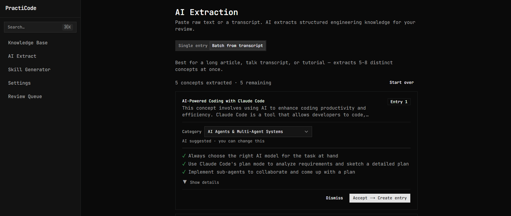
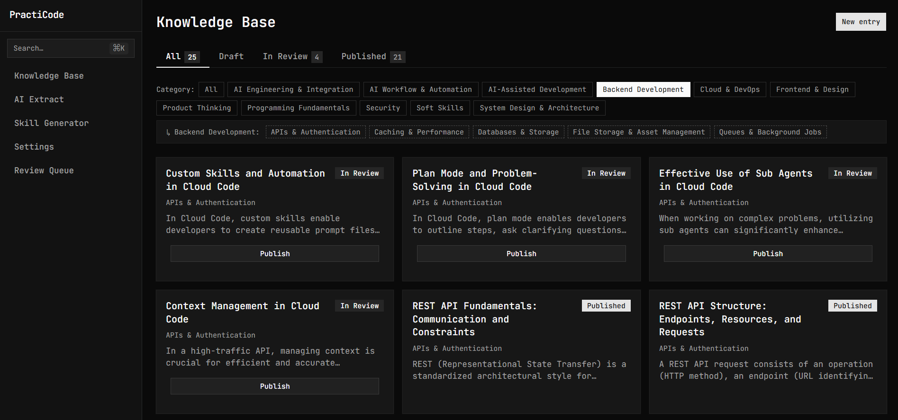
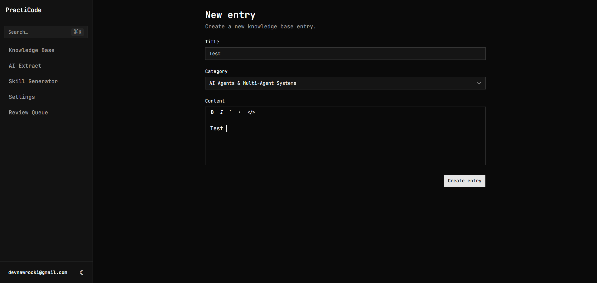
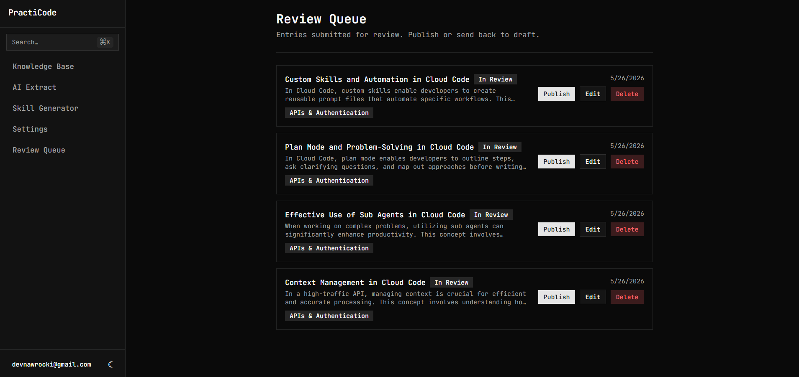
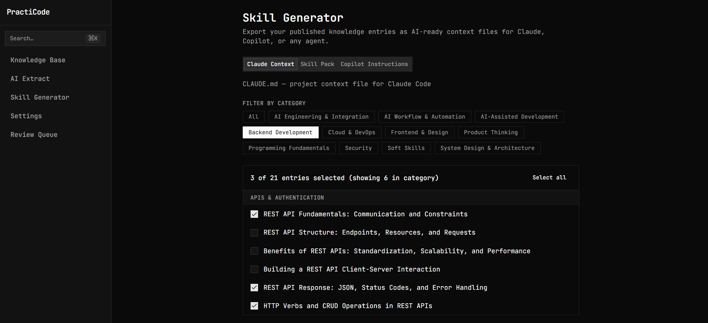

# PractiCode

An AI-assisted software engineering knowledge platform. Engineers paste raw text — transcripts, articles, documentation — and AI extracts structured concepts (best practices, anti-patterns, code examples). Humans validate and publish. The result is a browsable, searchable knowledge base that can also be exported as AI context files for Claude, Copilot, or any coding agent.

## Features

### Public Knowledge Base

Anyone can browse and search published engineering concepts — no login required.

- **Homepage** with a hero search bar, a technology tag cloud, and a category grid spanning 66 topics across 11 AI-era disciplines
- **Browse by category** — two-level hierarchy: parent topic → subcategory → entries
- **Full-text + vector search** — keyword search combined with pgvector cosine similarity for semantically relevant results
- **Entry pages** with structured sections: problem, explanation, best practices, anti-patterns, code examples, refactoring guidance, related concepts, AI-suggested similar entries, and "more in this category"


---

### AI Extraction Pipeline

Paste raw text and let AI do the heavy lifting. Humans review and approve before anything goes live.

**Single extraction** — best for a focused snippet, StackOverflow answer, or docs page. Extracts one focused concept.

**Batch extraction** — best for a long article or talk transcript. Extracts 5–8 distinct concepts simultaneously, each presented as an independent review card.



The pipeline is intentionally human-in-the-loop:

```
raw text → AI draft (pending) → human review → in_review → admin publishes → published
```

AI **never** auto-publishes. Status can move forward or backward (`published → in_review → draft`), but the `draft → published` one-step shortcut is blocked by design.

---

### Knowledge Dashboard

Manage the full lifecycle of entries from a single authenticated view.

- **Status tabs** — All / Draft / In Review / Published (editors see "My Drafts" instead of "Draft")
- **Category filters** — click a parent category to expand its subcategories inline
- **Paginated grid** — 24 entries per page with previous / next navigation
- **New entry form** — Tiptap rich-text editor for explanation and refactoring guidance, shadcn inputs for all other fields
- **Entry history** — snapshot saved before every update, most-recent-first timeline



---

### Entry Editor

Full rich-text editing with syntax-highlighted code blocks, plus structured fields for every section of an entry: problem statement, best practices list, anti-patterns list, related concepts, tags, and category.



---

### Admin Review Queue

Admins see a dedicated queue of all entries awaiting review. Publish, edit inline, or send back to draft — all from one place.



---

### Skill Generator

Export your published knowledge as AI-ready context files — no manual copy-pasting required.

| Format | Output file | Used with |
|---|---|---|
| Claude Context | `CLAUDE.md` | Claude Code project context |
| Skill Pack | `skill.md` | Per-entry skill files for agents |
| Copilot Instructions | `copilot-instructions.md` | GitHub Copilot |

Filter by category, cherry-pick individual entries, preview the output in-browser, then download.



---

## Tech Stack

| Layer | Technology |
|---|---|
| Framework | Next.js 16.2.6 (App Router, Server Components) |
| UI | React 19, TypeScript strict, Tailwind CSS v4, shadcn/ui |
| Theme | `next-themes` — light / dark / system toggle |
| Editor | Tiptap v3 with syntax-highlighted code blocks |
| Database | Supabase (PostgreSQL), Drizzle ORM v0.45, postgres.js |
| Auth | Supabase SSR (`@supabase/ssr`) |
| AI | Vercel AI SDK + OpenRouter (`OPENROUTER_API_KEY`) |
| Vector search | pgvector — cosine similarity on `text-embedding-3-small` (1536-dim) embeddings |
| State | Zustand v5 (ephemeral UI state only) |
| Validation | Zod v4 on all server boundaries |
| Tests | Vitest 3 — lifecycle, draft promotion, schema unit tests |

---

## Getting Started

### Prerequisites

- Node.js 20+
- A [Supabase](https://supabase.com) project with the `pgvector` extension enabled
- An [OpenRouter](https://openrouter.ai) API key

### 1. Clone and install

```bash
git clone https://github.com/SzymekNawrocki/practicode.git
cd practicode
npm install
```

### 2. Configure environment variables

Create a `.env.local` file:

```env
# Supabase
NEXT_PUBLIC_SUPABASE_URL=
NEXT_PUBLIC_SUPABASE_PUBLISHABLE_KEY=   # formerly ANON_KEY — copy from Supabase dashboard

# Two database connections are required
DATABASE_URL=           # Transaction Pooler (port 6543) — used at runtime
DATABASE_DIRECT_URL=    # Direct connection  (port 5432) — used by drizzle-kit migrations only

# AI
OPENROUTER_API_KEY=

# Rate limiting (Upstash Redis — free tier)
UPSTASH_REDIS_REST_URL=
UPSTASH_REDIS_REST_TOKEN=

# Error monitoring (Sentry — optional but recommended for production)
SENTRY_DSN=
NEXT_PUBLIC_SENTRY_DSN=

# Public site URL (defaults to https://practicode.dev)
NEXT_PUBLIC_SITE_URL=https://practicode.dev
```

### 3. Enable pgvector

In the Supabase SQL editor:

```sql
CREATE EXTENSION IF NOT EXISTS vector;
```

### 4. Run migrations

```bash
npm run db:migrate
```

### 5. Seed categories and tags

```bash
npm run db:seed        # 66 AI-era categories (11 parents × 5 children each)
npm run db:seed-tags   # 18 system tags — TypeScript, Python, React, Go, etc. (idempotent)
```

### 6. Promote yourself to admin

After signing up, run in the Supabase SQL editor:

```sql
UPDATE users SET role = 'admin' WHERE email = 'your@email.com';
```

### 7. Start the dev server

```bash
npm run dev
```

Open [http://localhost:3000](http://localhost:3000).

---

## Scripts

```bash
npm run dev           # start dev server (Turbopack)
npm run build         # production build
npm run test          # run vitest unit tests
npm run test:watch    # vitest in watch mode
npm run db:generate   # generate SQL migrations from schema changes
npm run db:migrate    # apply migrations (uses DATABASE_DIRECT_URL)
npm run db:seed       # wipe and reseed categories
npm run db:seed-tags  # upsert system tags
npm run db:studio     # open Drizzle visual DB explorer
```

---

## Roles

| Role | Permissions |
|---|---|
| `viewer` | Browse published entries (public — no login required) |
| `editor` | Create and edit entries, run AI extraction |
| `admin` | All of the above + publish from the review queue, delete entries |

---

## Editorial Workflow

```
editor creates entry      →  draft
editor submits            →  in_review
admin reviews at /admin   →  published
```

Back-moves are allowed: `published → in_review`, `in_review → draft`. AI-accepted drafts land in `in_review` and still require an admin to publish. The `draft → published` shortcut is intentionally blocked.

---

## AI Models

The default extraction model is `meta-llama/llama-3.3-70b-instruct` via OpenRouter. Free-tier models are available in **Settings**. On failure the pipeline tries each fallback in order:

1. `deepseek/deepseek-v4-flash:free`
2. `google/gemma-4-31b-it:free`
3. `google/gemma-4-26b-a4b-it:free`
4. `meta-llama/llama-3.3-70b-instruct`

All models in the chain support tool calling, which is required for structured (`generateObject`) output.

---

## License

MIT
